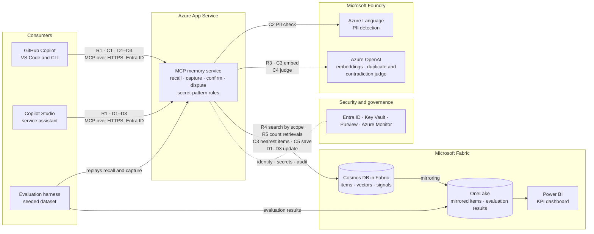

# Team Memory: technical architecture

This section of the blueprint shows how the [use case](usecase.md) is built on the [Microsoft services](microsoft-services.md) chosen for it.

## Architecture overview

**Recall, before a task**

1. The assistant calls `recall` on the MCP memory service with the task, the repository and the question, signed in with Microsoft Entra ID.
2. The service searches the current repository (if any), its owning team and the organization, limited to the scopes the caller may see.
3. Azure OpenAI embeds the question.
4. Cosmos DB in Fabric runs a vector search, filtered to those scopes and leaving out `superseded` items.
5. The top 3 items come back with their statement, provenance, confidence and status, and their retrieval counts go up.

**Capture, after a task**

1. The assistant calls `capture` with one statement, its type, its source (session, repository, file or commit) and its confidence. It picks the widest scope where the statement holds: in demo 1, the payments gotcha goes to organization scope, tagged with the payments client. The service rejects a scope the caller doesn't belong to.
2. The service checks the statement with its own secret-pattern rules, then with PII detection in Azure Language in Foundry Tools, limited to personal categories (such as names, email addresses, phone numbers, addresses, ID and financial numbers) above a confidence threshold. If either finds anything, the write is rejected and nothing is stored.
3. Azure OpenAI embeds the statement, and Cosmos DB in Fabric returns the closest existing items in the same scope.
4. Azure OpenAI compares the new statement with those items:
   - a duplicate is merged into the existing item, which gains the new source;
   - a contradiction is stored, and the two items are linked and both marked `disputed`;
   - anything else is stored as a new item.
5. Cosmos DB in Fabric saves the result: the new item with its provenance, author, confidence, status and vector, or the updated existing items. The author comes from the caller's Entra ID token, not from the client.

**Confirm and dispute, at any time**

1. `dispute` marks an item `disputed` and records who disputed it and why.
2. `confirm` sets an item's confidence to `confirmed` and records who confirmed it, for example after a test passed.
3. Confirming one side of a dispute resolves it: that item becomes `active`, and the other becomes `superseded`, linked to it. Only a signed-in person can resolve a dispute, not an agent.

## Core components

- **Layer 1: Consumers** – GitHub Copilot (VS Code and CLI) and other MCP clients for recall and capture, and a Copilot Studio agent as the service assistant.
- **Layer 2: Interface** – Stateless MCP memory service in Python on Azure App Service: `recall`, `capture`, `confirm`, `dispute` ([ADR-002](docs/adrs/adr-002-mcp-service-hosting.md)).
- **Layer 3: Safety** – PII detection in Azure Language in Foundry Tools, plus the service's own secret-pattern rules, on every write.
- **Layer 4: AI** – Azure OpenAI in Microsoft Foundry: embeddings, and judging duplicates and contradictions.
- **Layer 5: Data** – Cosmos DB in Microsoft Fabric: items, vectors and signals in one store. Proposed in [ADR-001](docs/adrs/adr-001-knowledge-store.md); if recall falls short, Azure AI Search is added for ranking.
- **Layer 6: Analytics** – Power BI KPI dashboard on OneLake. It reads the copy of the item store that Cosmos DB in Fabric mirrors there automatically, and the results an evaluation harness writes after replaying the seeded dataset against the service.
- **Layer 7: Governance** – Microsoft Entra ID for sign-in and team groups, Azure Key Vault for the App Service authentication secret, Microsoft Purview for cataloguing and labelling the Fabric data, and Azure Monitor for the audit log.

## Security and compliance

- **Scope-based visibility.** The service applies the scope filter on the server, from the caller's Entra ID identity, on every recall and capture. A client can narrow its scope but never widen it. The Copilot Studio tool uses each user's own credentials, not the maker's.
- **Filter on write.** Capture takes one statement, never a transcript. Secrets, credentials and personal data are rejected before the statement is embedded or stored, and rejections are logged without the rejected text.
- **Approved services only.** Item text leaves the service only for Azure OpenAI, Azure Language and Cosmos DB in Fabric, all in the project's own tenant.
- **Attributable, auditable writes.** Every capture, confirm, dispute, merge and supersede records who did it, person or agent, and is logged to Azure Monitor. Superseded items are kept, never overwritten.
- **No keys in clients or code.** The service reaches Cosmos DB, Azure OpenAI and Azure Language with a managed identity. The App Service authentication secret is kept in Key Vault.
- **Fail-open clients.** The assistant's instructions say to call recall first and, if it fails or is slow, to carry on and say memory is unavailable. The service also caps its own recall time. A failed capture never blocks the task.
- **Future enhancement:** per-user permissions and SSO beyond scoping by team.

## Diagram

Edge labels refer to the steps above: R for recall, C for capture, D for confirm and dispute.

## Verify before building

- Each team maps to one Entra ID group, and each repository to its owning team in configuration. Autonomous agents sign in as service principals in those groups.
- App Service publishes the sign-in metadata (preview), so VS Code signs in with Entra ID on its own. If it doesn't work in our tenant, the service publishes it with the MCP SDK.
- GitHub Copilot CLI can sign in to a remote MCP server with Entra ID. This isn't documented.
- Whether VS Code and Copilot CLI let you set a tool-call timeout. If not, fail-open relies on the assistant's instructions and the service's own time cap.
- Filtered vector search in Cosmos DB in Fabric is accurate enough. The ADR-001 recall test checks this.
- The Fabric tenant setting that lets service principals use Fabric APIs is on, so the service's managed identity can reach Cosmos DB in Fabric.
- Where the evaluation harness runs is not decided.
- The recall time cap is still to be tuned. A few seconds is assumed.
